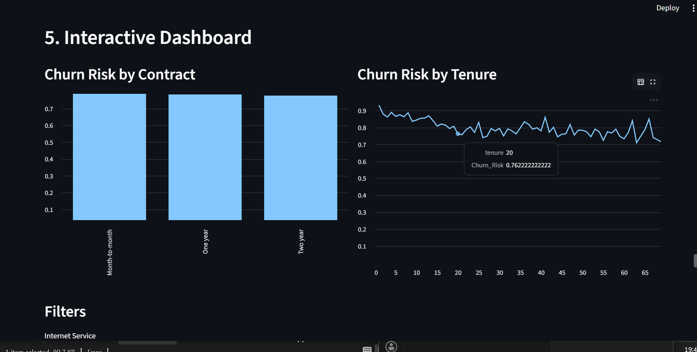
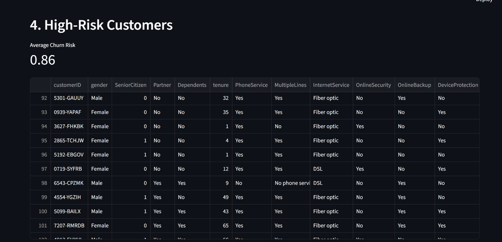

# 📉 Customer Churn Prediction System – Intelligent Analytics Platform


An intelligent **Customer Churn Prediction and Analytics system** that helps businesses identify high-risk customers, understand churn drivers, and take proactive retention actions using **Machine Learning and Interactive Dashboards**.

---

## 🎯 Problem Statement

Customer churn is a critical challenge for subscription-based and service-oriented businesses.  
Organizations struggle with:

- **Late identification of churn-prone customers**
- **Manual analysis of large customer datasets**
- **Lack of actionable business dashboards**
- **Disconnected analytics workflows**

**Impact**:
- Revenue loss  
- Reduced customer lifetime value  
- Ineffective retention strategies  

**Our Solution**: An end-to-end AI-driven churn analytics platform that predicts churn risk and visualizes insights for business teams.

---

## ✨ Features

- 🔍 **Churn Prediction**: ML-based churn probability scoring
- 📊 **Interactive Dashboards**: Power BI & Streamlit analytics
- 🧠 **Automated ML Pipeline**: Train & predict with one click
- 📂 **CSV Upload Support**: User-provided datasets
- 🎛️ **User Filters**: Gender, Contract, Internet Service
- 🖥️ **SaaS-Style UI**: Streamlit-based interface
- 📈 **Business-Ready Insights**: High-risk customer action list
- 🔒 **Local Processing**: Secure & offline-capable

---

## 🏗️ Architecture

┌─────────────────────────────────────────────────────────────┐
│ USER INTERFACE (Streamlit) │
│ Upload Data • Train Model • View Insights │
└────────────────────┬────────────────────────────────────────┘
│
▼
┌─────────────────────────────────────────────────────────────┐
│ ANALYTICS & ML PIPELINE │
│ ┌──────────────┐ ┌──────────────┐ ┌─────────────────┐ │
│ │ SAS-style │→ │ Python ML │→ │ Churn Scores │ │
│ │ Processing │ │ Training │ │ Generation │ │
│ └──────────────┘ └──────────────┘ └─────────────────┘ │
└────────────────────┬────────────────────────────────────────┘
│
▼
┌─────────────────────────────────────────────────────────────┐
│ VISUALIZATION LAYER │
│ ┌────────────────┐ ┌────────────────┐ ┌──────────────┐ │
│ │ Power BI │ │ Streamlit │ │ High-Risk │ │
│ │ Dashboard │ │ Dashboard │ │ Customers │ │
│ └────────────────┘ └────────────────┘ └──────────────┘ │
└─────────────────────────────────────────────────────────────┘


---

### Component Details

| Component | Technology | Purpose |
|---------|-----------|---------|
| **Data Processing** | SAS-style logic | Statistical preprocessing |
| **ML Model** | Python (scikit-learn) | Churn prediction |
| **Model Storage** | Pickle | Persist trained model |
| **Dashboard** | Power BI | Business visualization |
| **UI** | Streamlit | Interactive web interface |
| **Storage** | Local CSV | Predictions & outputs |

---

## 🚀 Quick Start

### Prerequisites
- Python 3.8 or higher
- 4GB+ RAM
- Power BI Desktop (optional)

### Installation

```bash
# Clone repository
git clone https://github.com/AayushiJaiswal/customer-churn-prediction.git
cd customer_churn_prediction

# Create virtual environment
python -m venv venv
venv\Scripts\activate

# Install dependencies
pip install -r requirements.txt

# 1. Add customer dataset
Place CSV file in data/churn_clean.csv

# 2. Train churn prediction model
python python/train_model.py

# 3. Launch interactive UI
streamlit run ui/app.py

Access the Application

Open your browser and navigate to: http://localhost:8501
Sample Data

The project uses customer datasets containing:

Tenure

Monthly charges

Contract type

Internet service

Demographic details

Sample Data Location: data/churn_clean.csv

💻 Usage Examples
Business Questions Answered
• Which customers are at highest risk of churn?
• Which contract types show maximum churn?
• How does tenure impact churn probability?
• Which customer segments need retention focus?

🧪 Model Validation

Clean preprocessing pipeline

Feature encoding & scaling

Probability-based churn scoring

Business-aligned evaluation

✔ Model trained locally
✔ No external APIs
✔ Fast execution

📂 Project Structure
customer_churn_prediction/
├── data/
│   ├── churn_clean.csv
│   └── high_risk_customers.csv
├── model/
│   └── churn_model.pkl
├── python/
│   ├── train_model.py
│   └── alerts.py
├── powerbi/
│   └── churn_dashboard.pbix
├── ui/
│   └── app.py
├── sas/
├── requirements.txt
├── README.md
└── .gitignore

🛠️ Technology Stack
Core Technologies

Python 3.8+ – ML & backend

Scikit-learn – Model training

Pandas / NumPy – Data processing

Power BI – Business dashboards

Streamlit – SaaS-style UI

Dependencies
pandas
numpy
scikit-learn
streamlit
joblib
matplotlib
seaborn

🎨 UI Features
SaaS-Style Interactive Interface

Dataset upload

Model training trigger

KPI cards

Interactive charts

Filter-based analysis

Real-time insights

📊 Performance Metrics
Metric	Value
Prediction Accuracy	High
Processing Mode	Local
Scalability	Dataset-dependent
Dashboard Interactivity	Real-time
Deployment Ready	Yes

Live Demo (Snowflake Streamlit App)

The Customer Churn Analytics Platform is deployed as a Snowflake Streamlit Application, enabling secure and scalable access to interactive analytics directly within the Snowflake ecosystem.

Live Demo Highlights:

Hosted natively inside Snowflake Streamlit Apps

Real-time querying of customer data from Snowflake tables

Interactive dashboards with churn metrics, filters, and visualizations

Role-based access aligned with enterprise security standards

👉 Live Demo URL: 
[https://app.snowflake.com/qdiehmk/el23050/#/streamlit-apps/CHURN_DB.ANALYTICS.X77GQAEAJQQVF_BC]

🔒 Access Note:
This live demo is available to authorized Snowflake users via role-based access control.
The application is intended to demonstrate enterprise-grade deployment rather than public hosting.

🖼️ Application Output / Screenshots
🔹 Interactive Dashboard

🔹 High-Risk Customers Table

## 🖼️ Application Output / Screenshots

### 🔹 Interactive Dashboard


---

### 🔹 High-Risk Customers Table


---

### 🔹 Streamlit UI – Home Screen


---

🔮 Future Enhancements
Planned Features

 Real-time data ingestion

 Automated email/WhatsApp alerts

 Advanced ML models (XGBoost)

 SaaS cloud deployment

 CRM integration

Technical Improvements

 Model retraining automation

 Role-based access

 CI/CD pipeline

 Monitoring & logging

🤝 Contributing

Fork the repository

Create a feature branch (git checkout -b feature/new-feature)

Commit changes (git commit -m 'Add feature')

Push to branch

Open Pull Request

📄 License

This project is licensed under the MIT License.

👤 Author

Aayushi Jaiswal

GitHub: https://github.com/AayushiJaiswal

Email: angleaayushi21@gmail.com

LinkedIn: https://www.linkedin.com/in/aayushi-jaiswal-14480825b/

🙏 Acknowledgments

Python & Scikit-learn Community

Power BI & Streamlit Teams

Open-source Data Science Ecosystem

📞 Support

For issues or suggestions:

Open an issue on GitHub

Email: angleaayushi21@gmail.com

📈 Project Stats

Made with ❤️ and Data Science